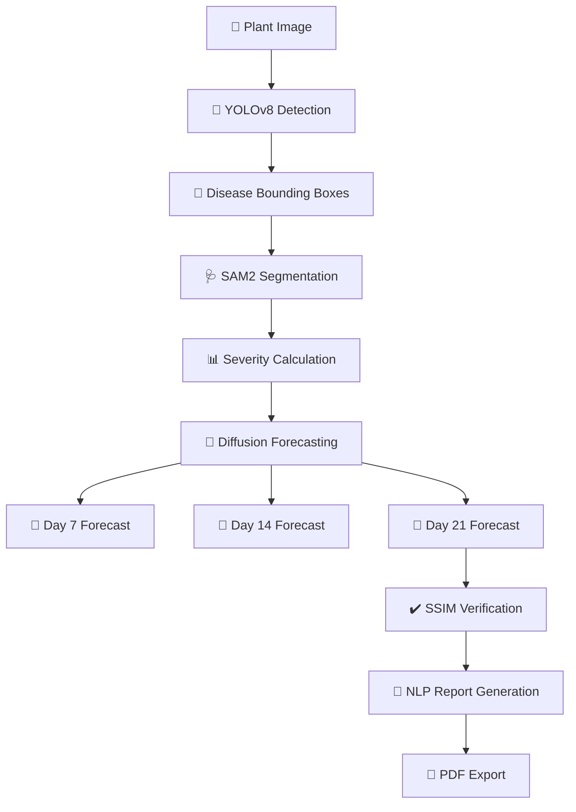

# 🌾 CropForge

<div align="center">


### **AI-Powered Agricultural Disease Intelligence Platform**

#### Detection • Segmentation • Generative Forecasting • NLP Reporting

<p align="center">
  
  
  
  
  
  
</p>

<p align="center">
  
  
  
</p>

---

## 🚀 From a Single Plant Image → Complete Disease Intelligence

CropForge transforms a single crop image into:

✅ Disease Identification
✅ Severity Estimation
✅ Pixel-Level Segmentation
✅ AI-Generated Future Disease Forecasts
✅ Treatment Verification
✅ NLP-Based Agricultural Reports

---

</div>

# 🎥 Live AI Pipeline Demo

<div align="center">

| Input Leaf                 | Segmentation                 | Forecast                 | Report                         |
| -------------------------- | ---------------------------- | ------------------------ | ------------------------------ |
|  |  |  |  |

</div>

---

# 🌍 Why CropForge Matters

Crop diseases destroy **20–40% of global food production annually**.

Current agricultural AI systems only answer:

> “What disease is this?”

CropForge answers:

* **How severe is the disease?**
* **What will happen in 7, 14, or 21 days?**
* **Will the treatment actually work?**
* **Can recovery be verified automatically?**

---

# 🧠 Core Innovation

> CropForge introduces a **temporally-conditioned latent diffusion model** for agricultural disease progression forecasting.

Unlike traditional image generation systems:

| Traditional AI Systems  | CropForge                          |
| ----------------------- | ---------------------------------- |
| Static classification   | Temporal forecasting               |
| Single prediction       | Multi-day simulation               |
| No treatment awareness  | Treatment-conditioned forecasts    |
| Generic image synthesis | Biologically plausible progression |
| No reporting            | NLP field reports                  |

---

# 🏗️ Interactive Pipeline Architecture



---

# ⚡ AI Model Stack

<div align="center">

| Stage        | Technology                    | Purpose                       |
| ------------ | ----------------------------- | ----------------------------- |
| Detection    | YOLOv8-m                      | Disease localization          |
| Segmentation | Meta SAM 2                    | Pixel-level disease masks     |
| Forecasting  | Stable Diffusion + ControlNet | Disease progression synthesis |
| Verification | SSIM Comparator               | Treatment efficacy scoring    |
| Reporting    | GPT-4o / Llama-3              | NLP field reports             |
| Backend      | FastAPI                       | API orchestration             |
| Deployment   | Docker + HuggingFace          | Cloud deployment              |

</div>

---

# 🧪 Interactive Forecast Simulation

## Example Scenario

### 🍅 Tomato Leaf — Early Blight

| Timeline | AI Forecast            |
| -------- | ---------------------- |
| Day 0    | Initial infection      |
| Day 7    | Lesion spread detected |
| Day 14   | Severe necrosis begins |
| Day 21   | Critical crop damage   |

<div align="center">


➡️

➡️

➡️


</div>

---

# 📊 Model Performance

<div align="center">

| Component              | Benchmark    |
| ---------------------- | ------------ |
| Detection Accuracy     | ≥ 0.82 mAP50 |
| Forecast Horizon       | 21 Days      |
| Training Images        | 54,306       |
| Disease Classes        | 38           |
| Segmentation Precision | Pixel-Level  |
| End-to-End Latency     | < 30 Seconds |
| Target SSIM            | ≥ 0.85       |

</div>

---

# 🚀 Quick Start

# 1️⃣ Clone Repository

```bash
git clone https://github.com/yourusername/cropforge.git
cd cropforge
```

---

# 2️⃣ Create Environment

```bash
python -m venv venv
source venv/bin/activate
```

Windows:

```bash
venv\Scripts\activate
```

---

# 3️⃣ Install Dependencies

```bash
pip install -r requirements.txt
```

---

# 4️⃣ Run CropForge

```bash
python app.py
```

---

# 🖼️ Example Usage

```python
from cropforge import CropForgePipeline

pipeline = CropForgePipeline(device="cuda")

result = pipeline.process(
    image_path="leaf.jpg",
    treatment="fungicide_a",
    humidity=65,
    temperature=28
)

print(result)
```

---

# 📂 Repository Structure

```bash
cropforge/
│
├── models/
│   ├── detection/
│   ├── segmentation/
│   ├── diffusion/
│   └── verification/
│
├── api/
├── frontend/
├── notebooks/
├── docker/
├── scripts/
├── docs/
└── tests/
```

---

# 📈 Research Contributions

<details>
<summary>🧬 Temporally-Conditioned Diffusion Model</summary>

CropForge extends Stable Diffusion using:

* Disease embeddings
* Treatment embeddings
* Time conditioning
* Environmental variables
* SAM2 spatial masks

The system predicts biologically plausible future crop states.

</details>

---

<details>
<summary>🎯 Multi-Model AI Pipeline</summary>

CropForge combines:

* YOLOv8
* SAM2
* Diffusion Models
* SSIM Verification
* NLP Generation

into one production-ready agricultural intelligence platform.

</details>

---

<details>
<summary>📄 NLP Field Report Generation</summary>

The system automatically generates:

* Disease summaries
* Severity assessments
* Treatment recommendations
* Forecast explanations
* PDF-ready reports

using GPT-4o / Llama-3.

</details>

---

# 🛠️ Development Timeline

## 8-Week Engineering Roadmap

* [x] OpenCV Foundations
* [x] Computer Vision Fundamentals
* [x] PyTorch + CNNs
* [x] YOLOv8 Integration
* [ ] SAM2 Segmentation
* [ ] Diffusion Training
* [ ] FastAPI Deployment
* [ ] Dockerization
* [ ] HuggingFace Deployment
* [ ] Production Dashboard

---

# 🐳 Docker Deployment

## CPU Deployment

```bash
docker build -t cropforge .
docker run -p 8000:8000 cropforge
```

---

## GPU Deployment

```bash
docker build -f Dockerfile.gpu -t cropforge:gpu .
docker run --gpus all -p 8000:8000 cropforge:gpu
```

---

# 🌐 API Endpoints

| Endpoint    | Method | Purpose               |
| ----------- | ------ | --------------------- |
| `/detect`   | POST   | Disease detection     |
| `/segment`  | POST   | Segmentation          |
| `/forecast` | POST   | Disease forecasting   |
| `/verify`   | POST   | Recovery verification |
| `/report`   | POST   | NLP report generation |

---

# 📸 Dashboard Preview

<div align="center">


</div>

---

# 🔮 Future Roadmap

* [ ] Mobile App Deployment
* [ ] Drone-Based Disease Scanning
* [ ] Satellite Integration
* [ ] Federated Learning
* [ ] Real-Time Field Analytics
* [ ] Edge AI Inference
* [ ] IoT Weather Integration

---

# 👨‍💻 Author

## Meet Joshi

B.Tech CSE — PDEU Gandhinagar

* 🌐 AI/ML Engineer
* 🧠 Computer Vision & Generative AI
* 🚀 Building real-world AI systems

---

# 🙏 Acknowledgements

* Ultralytics — YOLOv8
* Meta AI — SAM2
* Hugging Face — Diffusers
* PyTorch Team
* OpenAI
* FastAPI

---

# ⭐ Support the Project

If you like CropForge:

🌟 Star the repository
🍴 Fork the project
🧠 Contribute ideas
🚀 Build the future of agricultural AI

---

<div align="center">

# 🌾 CropForge

### *Where Computer Vision Meets Agricultural Intelligence*

</div>
